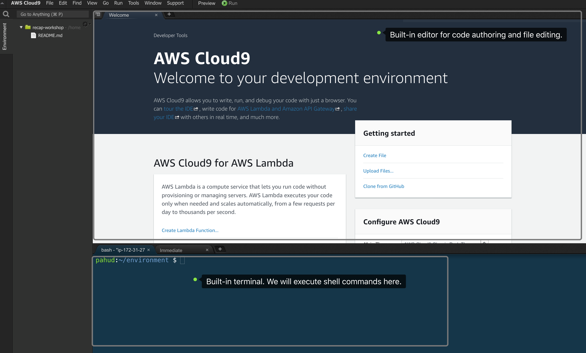

# Lab 0: Initial Setup


## Prerequisities

If you are completing this workshop at an AWS-sponsored event where an AWS account is provided for you, you will be using **AWS Event Engine**. In this case, the prerequisites is already met and you can move on to next step. 

If you not not using AWS Event Engine, expand below to see prerequisites: 

<details>
<summary><strong> Prerequisites if you are not using AWS Event Engine </strong></summary><p>


### AWS Account
In order to complete this workshop, you'll need an AWS account and access to create and manage the AWS resources that are used in this workshop, including Cloud9, API Gateway, Lambda, Amazon ECS, and IAM policies and roles.

The code and instructions in this workshop assume only one participant is using a given AWS account at a time. If you attempt sharing an account with another participant, you may encounter naming conflicts for certain resources. You can work around this by using distinct Regions, but the instructions do not provide details on the changes required to make this work.

Please make sure not to use a production AWS environment or account for this workshop. It is recommended to instead use a **development account** which provides **full access** to the necessary services so that you do not run into permissions issues.


### Region Selection
Use a single region for the entirety of this workshop. This workshop was designed and tested in **Tokyo region(ap-northeast-1)**. As some new features may not be available in other regions, please select **Tokyo** region entirely for this workshop.

.</details>

## Lab-0A: Create a Cloud9 environment required for this workshop

Go to [cloud9 console](https://ap-northeast-1.console.aws.amazon.com/cloud9/home?region=ap-northeast-1#) in the Tokyo region, click **Create environment** to create a fresh new Cloud9 IDE. Enter  "**recap-workshop**" as the Name of the environment. Leave everything as is in the Configure settings. Click **Next step** and click **Create environment**.

Your new **Cloud9** IDE will be ready just in a few minutes.




## Lab-0B: Setup your AWS CDK environment in Cloud9

We will provision some basic AWS environment with AWS CDK, wihch is based on nodejs and NPM. Let's setup our AWS CDK environment in the Cloud9 build-in console.

```bash
# in the cloud9 build-in console
$ npm i -g aws-cdk
$ cdk version
(check the cdk version output)
```


Now your AWS CDK environment is ready. Let's move to the next Lab.

