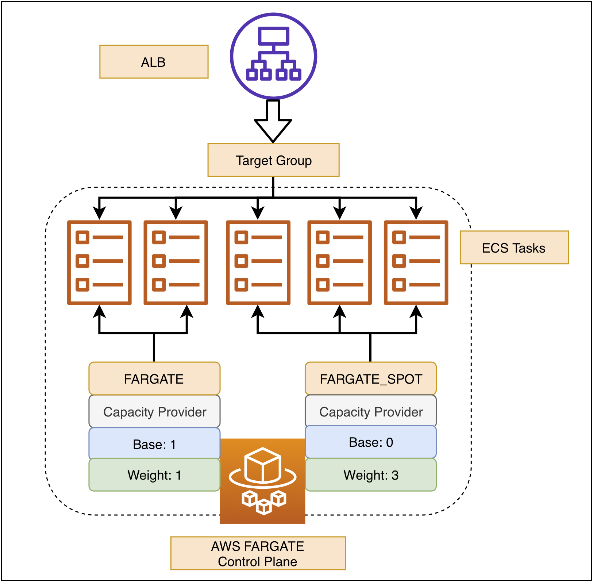

# Amazon ECS CAS(Cluster Auto Scaling) with FARGATE and FARGATE_SPOT

In this Lab, we are going to create an Amazon ECS cluster with **Capacity Provider** by **FARGATE** and **FARGATE_SPOT**.




## Clone the repo

```bash
$ git clone https://github.com/pahud/recap-serverless-container-workshop.git
```


## Deploy the stack

```bash
# deploy into default VPC
$ cd recap-serverless-container-workshop/lab2
# install required npm modules
$ npm i
# bootstrap your environment for CDK(you only need do it once)
$ cdk bootstrap -c USE_DEFAULT_VPC=1 -c region=ap-northeast-1
# deploy the stack 
$ cdk deploy -c USE_DEFAULT_VPC=1 -c region=ap-northeast-1
(this may take a few minutes)
```


```bash
#!/bin/bash

CLUSTER_NAME='Lab2Stack-ClusterEB0386A7-N7ZYJ0FVS4WB'
SERVICE_NAME='Lab2Stack-SvcServiceF685A632-1D7AS8KP5KANH'
FARGATE_WEIGHT=1
FARGATE_SPOT_WEIGHT=3
FARGATE_BASE=1
FARGATE_SPOT_BASE=0
REGION='ap-northeast-1'

export AWS_DEFAULT_REGION=$REGION

# update the existing cluster
aws ecs put-cluster-capacity-providers --cluster ${CLUSTER_NAME}  \
--capacity-providers FARGATE FARGATE_SPOT \
--default-capacity-provider-strategy capacityProvider=FARGATE_SPOT,weight=1

# update existing service
aws ecs update-service --cluster ${CLUSTER_NAME} --service ${SERVICE_NAME} \
--capacity-provider-strategy capacityProvider=FARGATE_SPOT,weight=${FARGATE_SPOT_WEIGHT},base=${FARGATE_SPOT_BASE} \
capacityProvider=FARGATE,weight=${FARGATE_WEIGHT},base=${FARGATE_BASE} --force-new-deployment

# describe the service to see its capacityProviderStrategy
aws ecs describe-services --cluster ${CLUSTER_NAME} --service ${SERVICE_NAME} --query 'services[0].capacityProviderStrategy'                  
[
    {
        "capacityProvider": "FARGATE_SPOT",
        "weight": 1,
        "base": 0
    },
    {
        "capacityProvider": "FARGATE",
        "weight": 1,
        "base": 1
    }
]
```


redeploy with AWS CDK with new desired task number as 5

```bash
$ cdk deploy -c USE_DEFAULT_VPC=1 -c region=ap-northeast-1 -c DESIRED_COUNT=5
```


```bash
# get all tasks
$ tasks=($(aws ecs list-tasks --cluster Lab2Stack-ClusterEB0386A7-N7ZYJ0FVS4WB --query taskArns --output text))
# describe all tasks
$ aws ecs describe-tasks --cluster Lab2Stack-ClusterEB0386A7-N7ZYJ0FVS4WB --tasks ${tasks} --query 'tasks[].[taskArn,capacityProviderName]'
[
    [
        "arn:aws:ecs:ap-northeast-1:903779448426:task/Lab2Stack-ClusterEB0386A7-N7ZYJ0FVS4WB/17c3539769de4a789912dbe445b31dba",
        "FARGATE_SPOT"
    ],
    [
        "arn:aws:ecs:ap-northeast-1:903779448426:task/Lab2Stack-ClusterEB0386A7-N7ZYJ0FVS4WB/58190fc548874c819b352e1869d43e13",
        "FARGATE_SPOT"
    ],
    [
        "arn:aws:ecs:ap-northeast-1:903779448426:task/Lab2Stack-ClusterEB0386A7-N7ZYJ0FVS4WB/73dae33ff0e3467999d3a0f9fae08315",
        "FARGATE"
    ],
    [
        "arn:aws:ecs:ap-northeast-1:903779448426:task/Lab2Stack-ClusterEB0386A7-N7ZYJ0FVS4WB/ab2b038b890b4b13ad2dc19d094af3b4",
        "FARGATE_SPOT"
    ],
    [
        "arn:aws:ecs:ap-northeast-1:903779448426:task/Lab2Stack-ClusterEB0386A7-N7ZYJ0FVS4WB/dc3cdcb1ad0043d7822baa71f6a83f07",
        "FARGATE_SPOT"
    ]
]
```


| Capacity Provider | Weight | Base | Total(1) | Total(2) | Total(4) | Total(10) | Total(12) |
| ----------------- | ------ | ---- | -------- | -------- | -------- | --------- | --------- |
| **FARGATE**       | 1      | 1    | 1        | 1        | 1        | 2         | 3         |
| **FARGATE_SPOT**  | 3      | 0    | 0        | 1        | 3        | 8         | 9         |

```txt
"The base value designates how many tasks, at a minimum, to run on the specified capacity provider. Only one capacity provider in a capacity provider strategy can have a base defined.

The weight value designates the relative percentage of the total number of launched tasks that should use the specified capacity provider. For example, if you have a strategy that contains two capacity providers, and both have a weight of 1, then when the base is satisfied, the tasks will be split evenly across the two capacity providers. Using that same logic, if you specify a weight of 1 for capacityProviderA and a weight of 4 for capacityProviderB, then for every one task that is run using capacityProviderA, four tasks would use capacityProviderB."
```

https://docs.aws.amazon.com/AmazonECS/latest/userguide/cluster-capacity-providers.html


# Quiz and Practice - All FARGATE_SPOT

1. Update the capacity provider strategy with 100% **FARGATE_SPOT** for your testing and development environment with AWS CLI.
2. Check the [Fargate Spot pricing for Amazon ECS](https://aws.amazon.com/fargate/pricing/?nc1=h_ls) in Tokyo region and calculate the total cost for **2*FARGATE_SPOT** tasks running for 24 hours with 2 vCore and 8GB memory each.
3. Let's say if am running 2 Fargate tasks as base capacity with 50% OFF discount from the [Savings Plans](https://aws.amazon.com/savingsplans/) and FARGATE to FARGATE_SPOT weight ratio is 1:5. I totally need 10 Fargate Tasks with 2 vCore 8GB each for 24HR in Tokyo region for a ticketing event. How much should I pay for the Fargate computing?


# Clean up and move to the next Lab

Just `cdk destroy` it.

```bash
$ cdk destroy -c USE_DEFAULT_VPC=1 -c region=ap-northeast-1 
```


# Further Reading

Using Fargate Spot to Optimize Costs for Serverless Containers - AWS Online Tech Talks - https://youtu.be/HkBleSbYu4k

