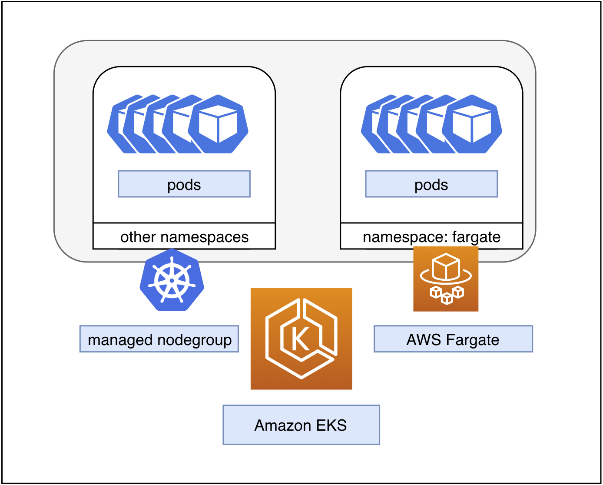
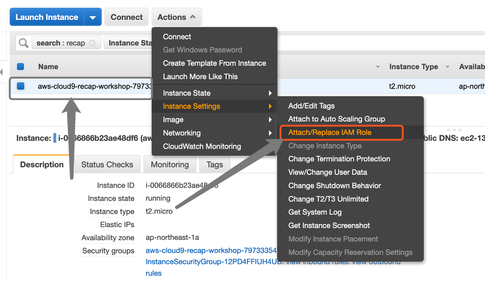
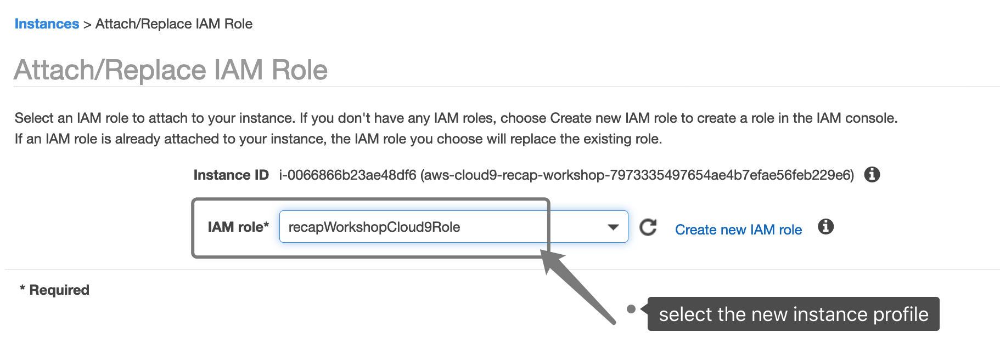
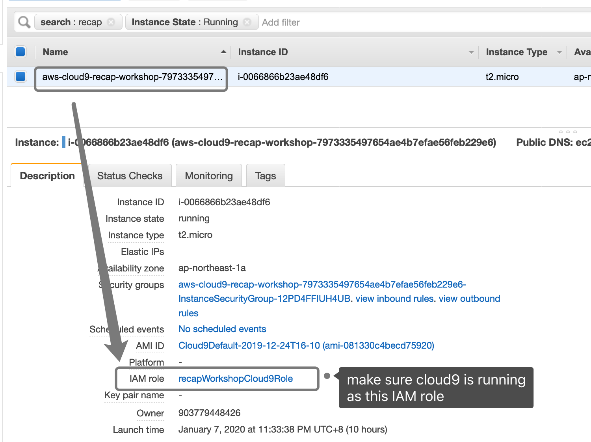
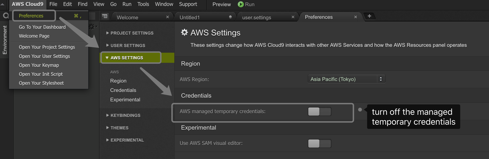
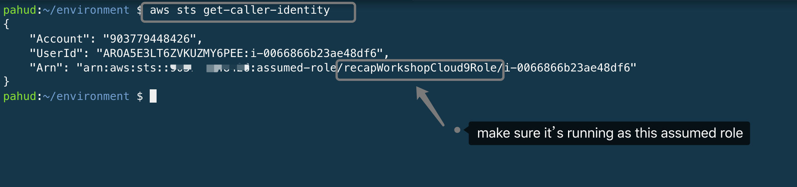

# Amazon EKS with AWS Fargate

In this lab, we will create an Amaozn EKS cluster with managed nodegroup mixed with 1 `m5.large` instance and multiple Fargate instances.



## Install `eksctl`

```bash
$ curl --silent --location "https://github.com/weaveworks/eksctl/releases/download/latest_release/eksctl_$(uname -s)_amd64.tar.gz" | tar xz -C /tmp
$ sudo mv /tmp/eksctl /usr/local/bin
$ eksctl version
```

## create the amin role and instance profile for cloud9

```bash
$ aws iam create-role --role-name recapWorkshopCloud9Role --assume-role-policy-document file://assume-role-policy.json
$ aws iam attach-role-policy --role-name recapWorkshopCloud9Role --policy-arn arn:aws:iam::aws:policy/AdministratorAccess
$ aws iam create-instance-profile --instance-profile-name recapWorkshopCloud9Role
$ aws iam add-role-to-instance-profile --role-name recapWorkshopCloud9Role --instance-profile-name recapWorkshopCloud9Role
```

## attach the new instance profile to Cloud9












## Create EKS cluster with Fargate support


```bash
$ eksctl create cluster \
      --name recap-workshop \
      --version 1.14 \
      --node-type m5.large \
      --nodes 1 \
      --managed
```


(this may take a few minutes)

open another terminal tab and install `kubectl` client binary

```bash
$ curl -o kubectl https://amazon-eks.s3-us-west-2.amazonaws.com/1.14.6/2019-08-22/bin/linux/amd64/kubectl
$ chmod +x ./kubectl
$ mkdir -p $HOME/bin && cp ./kubectl $HOME/bin/kubectl && export PATH=$HOME/bin:$PATH
$ kubectl version --short --client
```

## get the nodes

On cluster created, let's get the nodes

```bash
# get the nodes
$ kubectl get no
```

get all pods from all namespaces

```bash
$ kubectl get po -A
```


## deploy nginx service

```bash
$ kubectl apply -f nginx.yaml
```

## create a Fargate profile

Let's create a Fargate profile for the `fargate` namespace, in this case, all deployment with pods in this namespace will be running as Fargate.


```bash
# create the fargate namespace
$ kubectl create namespace fargate

# generate a Fargate profile for the fargate namespace
$ eksctl create fargateprofile --cluster recap-workshpo --name fargate-dev  --namespace fargate

# let's re-deploy the nginx service into the fargate namespace
$ kubectl apply -f nginx.yaml --namespace fargate

# get the pods
$ kubectl get po -A
```

## clean up

```bash
$ eksctl delete cluster --name recap-workshop
```


# Further Reading
Amazon EKS on AWS Fargate Now Generally Available - https://aws.amazon.com/tw/blogs/aws/amazon-eks-on-aws-fargate-now-generally-available/

Amazon EKS with AWS Fargate and HPA - https://github.com/aws-samples/eks-workshop-greater-china/blob/master/%E6%AD%A5%E9%AA%A44-%E9%83%A8%E7%BD%B2%E7%A4%BA%E4%BE%8B%E5%BA%94%E7%94%A8%EF%BC%8C%E9%80%9A%E8%BF%87HPA%E6%B5%8B%E8%AF%95Fargate%E5%BC%B9%E6%80%A7%E4%BC%B8%E7%BC%A9%E5%8A%9F%E8%83%BD.md

Amazon EKS with ALB Ingress Controller on AWS Fargate - https://github.com/pahud/amazon-eks-workshop/blob/master/eks-fargate/README.md