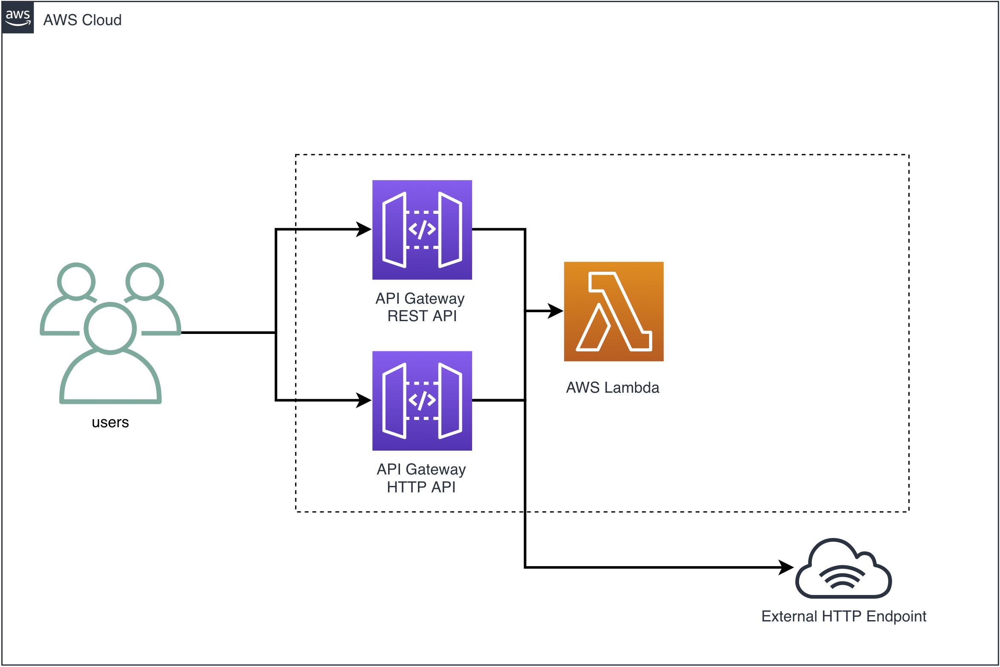
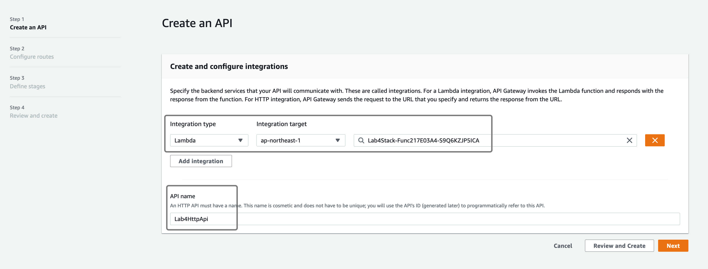
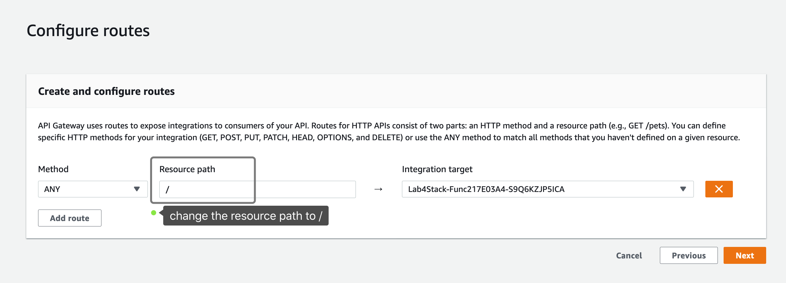
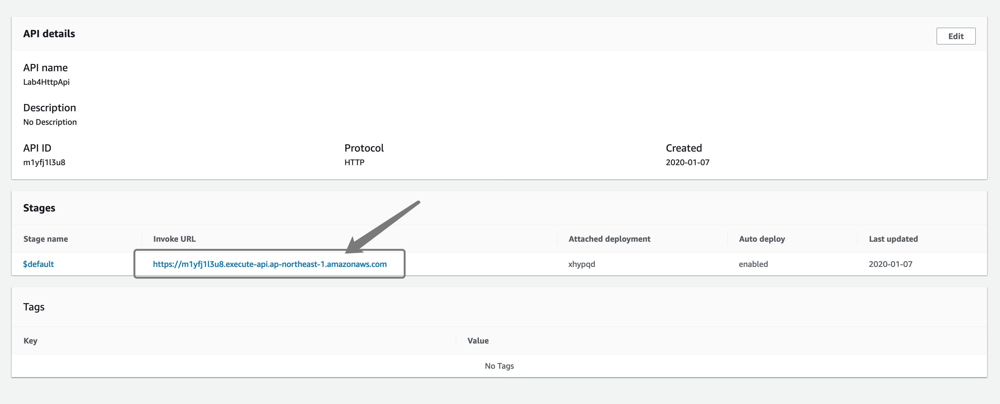

# Amazon API Gateway HTTP and REST API

In this lab, we are going to deploy the `Amazon API Gateway REST API` with `Lambda proxy integration` as well as the new Amazon API Gateway HTTP API.




## Deploy with AWS CDK

```bash
# deploy the REST API and Lambda function
$ cdk deploy -c region=ap-northeast-1
```

Outputs
```
Outputs:
Lab4Stack.RestApiEndpoint0551178A = https://ok4utj38oh.execute-api.ap-northeast-1.amazonaws.com/prod/
```
`cURL` the `RestApiEndpoint` URL 

```bash
$ curl -s https://ok4utj38oh.execute-api.ap-northeast-1.amazonaws.com/prod/ | jq -r
```

Response
```json
{
  "resource": "/",
  "path": "/",
  "httpMethod": "GET",
  "headers": {
    "Accept": "*/*",
    "CloudFront-Forwarded-Proto": "https",
    "CloudFront-Is-Desktop-Viewer": "true",
    "CloudFront-Is-Mobile-Viewer": "false",
    "CloudFront-Is-SmartTV-Viewer": "false",
    "CloudFront-Is-Tablet-Viewer": "false",
    "CloudFront-Viewer-Country": "TW",
    "Host": "ok4utj38oh.execute-api.ap-northeast-1.amazonaws.com",
    "User-Agent": "curl/7.54.0",
    "Via": "2.0 c84374aa07bf1c8360bd7da77f3a7d10.cloudfront.net (CloudFront)",
    "X-Amz-Cf-Id": "vG8-0NKvJGl-rupMxgqSSmHm1p4x0Zoi-O9lHmAxxG3F0HtjPdTFTg==",
    "X-Amzn-Trace-Id": "Root=1-5e146c42-027d9dfab0f753ae8ec4d8b7",
    "X-Forwarded-For": "...",
    "X-Forwarded-Port": "443",
    "X-Forwarded-Proto": "https"
  },
  "multiValueHeaders": {
    "Accept": [
      "*/*"
    ],
    "CloudFront-Forwarded-Proto": [
      "https"
    ],
    "CloudFront-Is-Desktop-Viewer": [
      "true"
    ],
    "CloudFront-Is-Mobile-Viewer": [
      "false"
    ],
    "CloudFront-Is-SmartTV-Viewer": [
      "false"
    ],
    "CloudFront-Is-Tablet-Viewer": [
      "false"
    ],
    "CloudFront-Viewer-Country": [
      "TW"
    ],
    "Host": [
      "ok4utj38oh.execute-api.ap-northeast-1.amazonaws.com"
    ],
    "User-Agent": [
      "curl/7.54.0"
    ],
    "Via": [
      "2.0 c84374aa07bf1c8360bd7da77f3a7d10.cloudfront.net (CloudFront)"
    ],
    "X-Amz-Cf-Id": [
      "vG8-0NKvJGl-rupMxgqSSmHm1p4x0Zoi-O9lHmAxxG3F0HtjPdTFTg=="
    ],
    "X-Amzn-Trace-Id": [
      "Root=1-5e146c42-027d9dfab0f753ae8ec4d8b7"
    ],
    "X-Forwarded-For": [
      "..."
    ],
    "X-Forwarded-Port": [
      "443"
    ],
    "X-Forwarded-Proto": [
      "https"
    ]
  },
  "queryStringParameters": null,
  "multiValueQueryStringParameters": null,
  "pathParameters": null,
  "stageVariables": null,
  "requestContext": {
    "resourceId": "hphx13vjye",
    "resourcePath": "/",
    "httpMethod": "GET",
    "extendedRequestId": "F7XaVFU_NjMFpNA=",
    "requestTime": "07/Jan/2020:11:32:18 +0000",
    "path": "/prod/",
    "accountId": "112233445566",
    "protocol": "HTTP/1.1",
    "stage": "prod",
    "domainPrefix": "ok4utj38oh",
    "requestTimeEpoch": 1578396738090,
    "requestId": "497aae07-d3b8-44f1-b541-f665c1d530fc",
    "identity": {
      "cognitoIdentityPoolId": null,
      "accountId": null,
      "cognitoIdentityId": null,
      "caller": null,
      "sourceIp": "...",
      "principalOrgId": null,
      "accessKey": null,
      "cognitoAuthenticationType": null,
      "cognitoAuthenticationProvider": null,
      "userArn": null,
      "userAgent": "curl/7.54.0",
      "user": null
    },
    "domainName": "ok4utj38oh.execute-api.ap-northeast-1.amazonaws.com",
    "apiId": "ok4utj38oh"
  },
  "body": null,
  "isBase64Encoded": false
}
```

## Create HTTP API with Lambda route

Open API Gateway console, click **Create API** and select **HTTP API**, click **Build**.


Select **Lambda** as Integration type, **ap-northeast-1** and **Lab4Stack-FuncXXXXXX** as the integration target.

Enter **Lab4HttpApi** as the API name.

Click **Next**.



In **Configure routes**, update the provided Resource path to **/** and leave other value as is. Click **Next**.



Copy the **invoke URL** from the console.



`cURL` the `Invoke URL` and view the response.

```bash
$ curl -s https://m1yfj1l3u8.execute-api.ap-northeast-1.amazonaws.com | jq -r
```

## Quiz and Challenges

1. create a `HTTP` backend at `/checkip` to `https://checkip.amazonaws.com/` and curl `http://{InvokeURL}/checkip` to see your IP address

2. modify the provided Lambda function in the cdk source code and return exactly the same response as `https://checkip.amazonaws.com/` from both the REST and HTTP API.

3. check the API Gateway pricing page and calculate the total API Gateway cost for a ticketing service running with API Gateway HTTP API with avg `1,000` request/sec running for 12 hours.


## clean up

1. manually delete the HTTP API from the API Gateway console
2. cdk destroy the REST API and Lambda function

```bash
$ cdk destroy -c region=ap-northeast-1
```